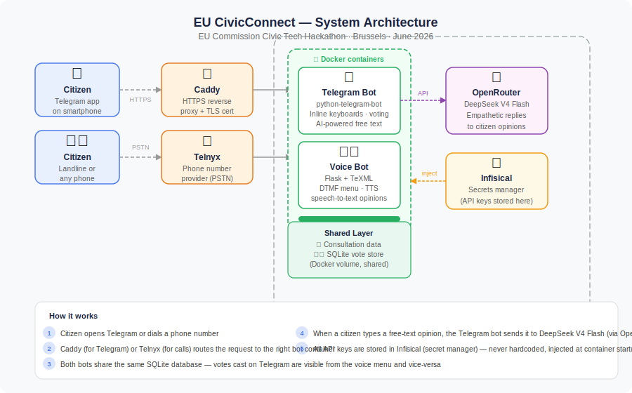

# LOOP

**[EU Commission Civic Tech Hackathon](https://commission.europa.eu/get-involved/events/eu-civic-tech-hackathon-22-23-june-2026-2026-06-22_en) · Brussels · 22-23 June 2026**
*LOOP Team · 1 of 3 highlighted projects*

A civic engagement platform that lets any citizen participate in public consultations — by Telegram or by phone. Built in 36 hours during the EU Commission Civic Tech Hackathon.

---

## What it does

Citizens can vote on and share opinions about real-world public consultations across three levels of governance (municipal, national, European) through two channels:

- **Telegram bot** — interactive cards with inline vote buttons, free-text opinion input, and an AI-generated acknowledgement for each citizen's view
- **Voice bot** — callable from any landline or smartphone via a DTMF menu, no app required

Both channels share the same vote database in real time.

---

## Architecture



| Component | Technology |
|---|---|
| Telegram bot | `python-telegram-bot` ≥ 20 (async, webhook mode) |
| Voice bot | Flask + [Telnyx TeXML](https://developers.telnyx.com/docs/voice/texml) |
| LLM | DeepSeek V4 Flash via [OpenRouter](https://openrouter.ai) |
| Reverse proxy | [Caddy](https://caddyserver.com) (auto TLS) |
| Database | SQLite (shared Docker volume) |
| Secret management | [Infisical](https://infisical.com) |
| Deployment | Docker Compose on a single VPS |

---

## Features

- Vote **Support / Oppose** on open consultations (one vote per user, SHA-256 hashed identity)
- Inline **live results** with visual progress bars
- **Free-text opinion** → DeepSeek V4 Flash generates an empathetic civic acknowledgement
- After voting on all consultations, citizens see a recently closed EU result as a real-world example
- `/status` command for aggregate vote counts
- Voice menu: DTMF 1/2/3 for consultations, 0 for results, spoken TTS with Telnyx native voices

---

## Setup

### 1. Clone and configure

```bash
git clone https://github.com/sergiofspedro/eu-commission-civic-tech-hackathon-2026.git
cd eu-commission-civic-tech-hackathon-2026
cp loop.env.example loop.env
# Edit loop.env and fill in your API keys
```

### 2. Secrets (required in `loop.env`)

| Variable | Where to get it |
|---|---|
| `LOOP_TELEGRAM_TOKEN` | [@BotFather](https://t.me/BotFather) on Telegram |
| `TELNYX_API_KEY` | [Telnyx console](https://portal.telnyx.com) |
| `TELNYX_PUBLIC_KEY` | Telnyx console → API Keys |
| `OPENROUTER_API_KEY` | [OpenRouter](https://openrouter.ai/keys) |
| `PUBLIC_DOMAIN` | Your server's public hostname (no `https://`) |

### 3. Deploy

```bash
# Install Caddy (handles HTTPS automatically)
apt install -y caddy
# Edit Caddyfile: replace "your-domain.com" with your domain
caddy start --config Caddyfile

# Start both bot containers
docker compose up -d --build

# Register Telegram webhook
TOKEN=$(grep LOOP_TELEGRAM_TOKEN loop.env | cut -d= -f2 | tr -d '"')
curl "https://api.telegram.org/bot${TOKEN}/setWebhook?url=https://${PUBLIC_DOMAIN}/telegram"
```

### 4. (Optional) Provision a phone number

```bash
export TELNYX_API_KEY=your_key
export PUBLIC_DOMAIN=your-domain.com
python telnyx_provision_number.py search BE   # search Belgian numbers
python telnyx_provision_number.py provision +32...
```

---

## Project structure

```
├── shared/
│   ├── consultations.py   # Consultation data (EU / national / municipal)
│   ├── database.py        # SQLite vote store (privacy-preserving SHA-256 IDs)
│   └── llm.py             # OpenRouter wrapper (DeepSeek V4 Flash)
├── telegram-bot/
│   ├── bot.py             # Telegram webhook handler
│   ├── Dockerfile
│   └── requirements.txt
├── voice-bot/
│   ├── app.py             # Flask + Telnyx TeXML
│   ├── Dockerfile
│   └── requirements.txt
├── docker-compose.yml
├── Caddyfile
├── setup_env.py           # Infisical secret bootstrap (optional)
├── telnyx_provision_number.py
└── docs/
    └── architecture.svg
```

---

## Privacy

User identities are stored as `SHA-256("loop:{telegram_user_id}")` — preventing double-voting while making it impossible to trace a vote back to a specific person.

---

## Hackathon context

Built at the **[EU Commission Civic Tech Hackathon](https://commission.europa.eu/get-involved/events/eu-civic-tech-hackathon-22-23-june-2026-2026-06-22_en)** (Brussels, 22-23 June 2026) as part of the **LOOP Team**. LOOP was one of 3 projects highlighted by the jury out of all submissions.

The hackathon challenge was to build tools that increase citizen participation in EU democratic processes. Our focus was on accessibility: reaching citizens who don't have smartphones or don't use messaging apps, by making consultations participable from any telephone.
